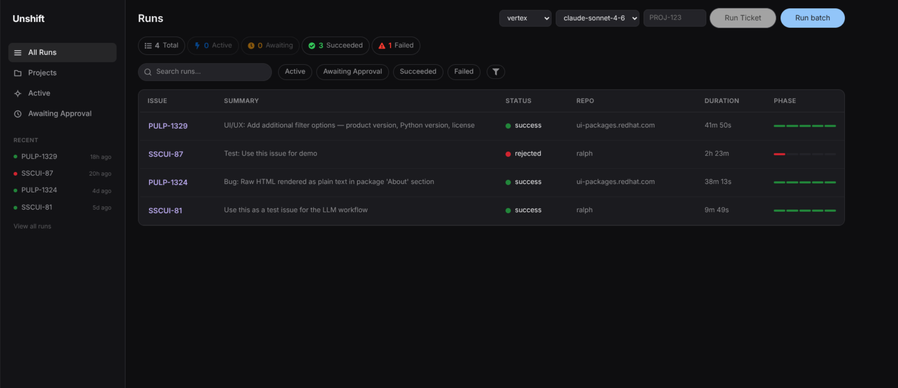

# Unshift

An automation tool that picks up Jira issues labeled `llm-candidate`, implements them using an LLM, and opens a pull request.

> The dashboard engine uses the [Vercel AI SDK](https://sdk.vercel.ai/) and supports multiple LLM providers (Anthropic, OpenAI, Google). The CLI scripts in `cli/` are an alternative entry point that uses [Claude Code](https://docs.anthropic.com/en/docs/claude-code) directly.

## Dashboard preview

<a href="unshift-ui.png"></a>

## How it works

Unshift runs four phases per issue:

1. **Discover**  - Queries the Jira REST API for issues labeled `llm-candidate` and determines which issues to process.
2. **Plan**  - Reads the Jira issue, maps it to a repo via `repos.yaml`, creates a branch, and generates an implementation plan (`prd.json`).
3. **Implement**  - Works through the plan one entry at a time. If a validation step fails, it automatically retries once with the error context. This keeps token usage flat and gives every entry the full context window.
4. **Deliver**  - Commits, pushes, opens a PR, updates Jira, and cleans up. When started from the dashboard, the run pauses here for approval before proceeding.

Each run executes in an isolated [git worktree](https://git-scm.com/docs/git-worktree), so multiple runs against the same repository can proceed in parallel without branch conflicts.

## Quick Start (Docker)

The fastest way to run unshift. Only Docker is required.

### 1. Clone and configure

```bash
git clone https://github.com/CryptoRodeo/unshift.git
cd unshift
cp .env.example .env
```

Edit `.env` and fill in your credentials (see [Credentials Reference](#credentials-reference)):

- **LLM provider** (at least one required):
  - `ANTHROPIC_API_KEY`  - for Anthropic / Claude (default provider)
  - `OPENAI_API_KEY`  - for OpenAI / GPT
  - `GOOGLE_GENERATIVE_AI_API_KEY`  - for Google / Gemini
  - Or Vertex AI config (see credentials reference)
- `UNSHIFT_PROVIDER`  - which provider to use: `anthropic` (default), `openai`, `google`, or `vertex`
- `UNSHIFT_MODEL`  - model ID to use (defaults: `claude-sonnet-4-6`, `gpt-4o`, `gemini-2.0-flash`)
- `JIRA_BASE_URL`, `JIRA_USER_EMAIL`, `JIRA_API_TOKEN`  - required for Jira integration
- `GH_TOKEN` or `GITLAB_TOKEN`  - required for PR/MR creation
- `GIT_USER_NAME`, `GIT_USER_EMAIL`  - used for git commits inside the container

You can also select the provider and model from the dashboard UI when starting a run.

### 2. Configure repos.yaml

Create a `repos.yaml` to map your Jira projects to repositories. See `repos.yaml.example` for the schema and a starting template.

Inside the container, repos are cloned under `/app/workspace/` (bind-mounted to `./workspace` on the host). Keep `local_dir` set to the path on your host machine (e.g. `~/work/my-repo`) — the dashboard uses it for the "Open Locally" dialog.

### 3. Start the dashboard

```bash
docker compose up --build
```

The dashboard will be available at `http://localhost:3000`.

- Run data (SQLite) persists in a Docker volume
- Cloned repos persist in `./workspace` on the host
- To stop: `docker compose down` (add `-v` to also delete the database volume)

**Vertex AI users:** Run `gcloud auth application-default login` on the host before starting the container. The compose file mounts your ADC credentials file automatically.

### 4. Troubleshooting

| Issue | Solution |
|---|---|
| Native module build failures (`better-sqlite3`) | Ensure you're building on a supported architecture (amd64/arm64). Run `docker compose build --no-cache` to rebuild from scratch. |
| `gh` not found inside container | The Dockerfile installs it during build. If the build was cached before it was added, run `docker compose build --no-cache`. |
| Permission errors on `./workspace` volume | The container runs as UID 1000 (`unshift` user). If the host user has a different UID, adjust ownership: `sudo chown -R $(id -u):$(id -g) ./workspace` |
| Git push/clone fails inside container | Verify `GH_TOKEN` (or `GITLAB_TOKEN`) is set in `.env`. The token needs `repo` scope (GitHub) or `api` scope (GitLab). |
| Container exits immediately | Check logs with `docker compose logs dashboard`. Common cause: missing required env vars in `.env`. |
| Database lost after `docker compose down` | Data is stored in a named volume (`dashboard-data`). Use `docker compose down` (without `-v`) to preserve it. Adding `-v` removes volumes. |
| Vertex AI: auth errors | Ensure `gcloud auth application-default login` was run on the host and the ADC file exists before starting the container. |
| Stale worktrees in `workspace/` | If a run was interrupted, orphaned worktrees may remain. Clean up with `git -C workspace/<repo> worktree prune`. |

## Local Development

Use this setup if you want to develop unshift itself (modify the dashboard, CLI scripts, etc.).

### 1. Install prerequisites

| Tool | Purpose |
|---|---|
| [Node.js](https://nodejs.org/) (v18+) | Runtime for the dashboard (uses the Vercel AI SDK for LLM calls) |
| [Git](https://git-scm.com/) | Version control (pre-installed on most systems) |

**Only needed if using the CLI scripts (`cli/`):**

| Tool | Purpose |
|---|---|
| [Claude Code](https://docs.anthropic.com/en/docs/claude-code) | CLI agent that runs each phase (`npm install -g @anthropic-ai/claude-code`) |
| [jq](https://jqlang.github.io/jq/) | Used by the CLI orchestrator |

**For PR/MR creation**, install one or both depending on your repos:

- [gh](https://cli.github.com/)  - GitHub PRs
- [glab](https://gitlab.com/gitlab-org/cli)  - GitLab MRs

Git must be configured with push access to your target repositories (e.g. via SSH keys or a credential helper).

### 2. Clone and initialize

```bash
git clone https://github.com/CryptoRodeo/unshift.git
cd unshift
./cli/init.sh
```

### 3. Configure credentials

Copy the template and fill in your tokens:

```bash
cp .env.example .unshift.env
```

Then source it (or export the variables in your shell):

```bash
source .unshift.env
```

**With Anthropic (default):**

```bash
ANTHROPIC_API_KEY=sk-ant-...
```

**With OpenAI:**

```bash
OPENAI_API_KEY=sk-...
UNSHIFT_PROVIDER=openai
```

**With Google Gemini:**

```bash
GOOGLE_GENERATIVE_AI_API_KEY=your-key
UNSHIFT_PROVIDER=google
```

**Common credentials (required regardless of provider):**

```bash
JIRA_BASE_URL=https://mycompany.atlassian.net
JIRA_USER_EMAIL=you@company.com
JIRA_API_TOKEN=your-jira-token
GH_TOKEN=ghp_...
# Or, if using GitLab instead:
# GITLAB_TOKEN=glpat-...
```

<details>
<summary><strong>With Vertex AI (Google Cloud)</strong></summary>

For the **dashboard**, set the Vertex AI environment variables — the provider is auto-detected when `ANTHROPIC_API_KEY` is not set:

```bash
ANTHROPIC_VERTEX_PROJECT_ID=<your-gcp-project-id>
CLOUD_ML_REGION=us-east5
UNSHIFT_PROVIDER=vertex   # optional — auto-detected when ANTHROPIC_API_KEY is absent
```

For the **CLI scripts**, set the Claude Code–specific flag instead:

```bash
CLAUDE_CODE_USE_VERTEX=1
CLOUD_ML_REGION=us-east5
ANTHROPIC_VERTEX_PROJECT_ID=<your-gcp-project-id>
```

In both cases you need active GCP credentials (`gcloud auth application-default login`).

</details>

See [Credentials Reference](#credentials-reference) for how to create each token and for Data Center configuration.

### 4. Run

#### Dashboard (recommended)

The dashboard is a web UI for starting, monitoring, and approving unshift runs.

```bash
cd dashboard
npm install
npm run dev
```

This starts both the Express/WebSocket server and the Vite dev server using `concurrently`. The client is available at `http://localhost:5173` and the API server runs on `http://localhost:3000`.

- Start and stop runs, view per-phase progress, and stream logs
- Select an LLM provider and model per run, or use the defaults from your `.env`
- Multiple runs on the same repo can execute in parallel (each gets its own worktree)
- After Phase 2 completes, the run pauses for your approval  - review changes, then approve, reject, or retry before Phase 3 creates the PR
- Run history is stored in a local SQLite database (`dashboard/server/data/runs.db`) and persists across server restarts
- Issues that already completed successfully are skipped automatically; use the force option to re-run

#### CLI (Claude Code alternative)

The `cli/` directory contains the shell-based orchestrator that uses Claude Code directly. It runs the same phases without a web UI and requires a Claude Code installation.

```bash
./cli/unshift.sh
```

You can also target a single issue or just list what's available:

```bash
./cli/unshift.sh --issue PROJ-123   # process one issue
./cli/unshift.sh --discover         # list llm-candidate issues and exit
./cli/unshift.sh --retry --issue PROJ-123  # retry from prd.json (skips planning)
```

`--retry` resets the branch to its merge-base, marks all prd.json entries as incomplete, and re-runs Phase 2 and 3. Requires the `UNSHIFT_CONTEXT_FILE` env var pointing at the context file from the original run.

<details>
<summary><h2>Credentials Reference</h2></summary>

### Jira API token

**Jira Cloud:** Create a token at [Atlassian API token management](https://id.atlassian.com/manage-profile/security/api-tokens). Use the email of the account that created the token as `JIRA_USER_EMAIL`.

**Jira Data Center / Server:** Create a Personal Access Token from your Jira profile (Profile > Personal Access Tokens). Set `JIRA_AUTH_TYPE=bearer` and `JIRA_API_VERSION=2` in your `.unshift.env`. You do not need to set `JIRA_USER_EMAIL` when using bearer auth.

### GitHub token (`GH_TOKEN`)

Create a token with the **`repo`** scope (classic) or **Contents + Pull requests** read/write (fine-grained) at [GitHub token settings](https://github.com/settings/tokens). The `gh` CLI recognizes `GH_TOKEN` automatically  - no separate `gh auth login` is needed.

### GitLab token (`GITLAB_TOKEN`)

Create a token with the **`api`** scope at [GitLab access tokens](https://gitlab.com/-/user_settings/personal_access_tokens). The `glab` CLI recognizes `GITLAB_TOKEN` automatically  - no separate `glab auth login` is needed.

</details>

<details>
<summary><h2>Claude Code Skill (<code>/unshift</code>)</h2></summary>

Unshift also ships as a Claude Code [custom skill](https://docs.anthropic.com/en/docs/claude-code/skills) that you can invoke inside any Claude Code session with `/unshift`. The skill uses Jira MCP tools directly (instead of `acli`) and runs the full Jira-to-PR workflow from within Claude Code.

The skill uses the `gh` or `glab` CLI to create pull/merge requests  - see [Install prerequisites](#1-install-prerequisites) and [Credentials Reference](#credentials-reference).

### Install the skill

From the project where you want to use the skill, run:

```bash
mkdir -p .claude/skills/unshift
curl -fsSL https://raw.githubusercontent.com/CryptoRodeo/unshift/main/.claude/skills/unshift/SKILL.md \
  -o .claude/skills/unshift/SKILL.md
```

Claude Code automatically discovers skills in `.claude/skills/`.

### Configure the Jira MCP server

The skill communicates with Jira via the [Atlassian MCP server](https://support.atlassian.com/atlassian-rovo-mcp-server/docs/getting-started-with-the-atlassian-remote-mcp-server/).

Add the MCP server with your credentials in `.claude/settings.local.json` (this file should not be committed):

```json
{
  "mcpServers": {
    "atlassian": {
      "type": "url",
      "url": "https://mcp.atlassian.com/v1/sse",
      "headers": {
        "Authorization": "Basic <base64-encoded email:api-token>"
      }
    }
  }
}
```

To generate the Base64 value, run:

```bash
echo -n "you@company.com:your-jira-api-token" | base64
```

See [Credentials Reference](#credentials-reference) for how to get the token.

### Usage

Inside a Claude Code session, run:

```
/unshift              # discover and process all llm-candidate issues
/unshift PROJ-123     # process a specific issue
```

The skill reads `repos.yaml` from this repo's root to map Jira projects to repositories. See `repos.yaml.example` for the schema.

</details>

## File Reference

| File | Purpose |
|---|---|
| `dashboard/` | Web UI for starting, monitoring, and approving runs |
| `dashboard/server/src/engine/` | Agentic engine (orchestrator, phase runner, prompts, tools, providers) |
| `cli/unshift.sh` | Shell orchestrator  - drives all four phases |
| `cli/ralph/ralph.sh` | Implementation loop  - one `claude -p` per prd.json entry, with automatic retry on failure |
| `cli/prompts/phase1.md` | Phase 1 prompt template for repo setup and planning |
| `cli/prompts/phase3.md` | Phase 3 prompt template for PR creation and Jira update |
| `cli/init.sh` | Configures Claude Code permissions for CLI usage |
| `.claude/skills/unshift/SKILL.md` | Claude Code custom skill  - run `/unshift` inside a session |
| `compose.yml` | Docker Compose service definition for the dashboard |
| `dashboard/Dockerfile` | Multi-stage Docker build (no Claude Code — the engine calls LLM APIs directly) |
| `dashboard/entrypoint.sh` | Container entrypoint  - sets git identity and GCP credentials |
| `.dockerignore` | Files excluded from Docker build context |
| `repos.yaml` | Project-to-repository mapping (shared by dashboard and CLI) |
| `prd.json` | Implementation plan, created per issue, cleaned up after (in target repo at runtime) |
| `progress.txt` | Append-only execution log, cleaned up after (in target repo at runtime) |
| `runs.db` | SQLite database storing run history, logs, and progress (in `dashboard/server/data/` at runtime) |
